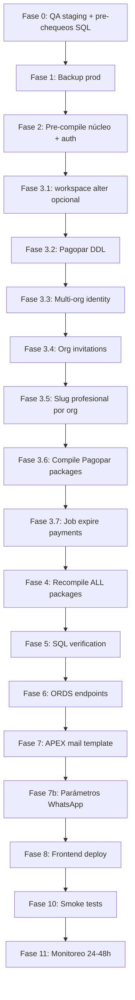

# Checklist de despliegue a producción — Bookmate / AOX

Documento maestro para desplegar en **orden seguro** los cambios acumulados:

| Bloque | Qué incluye | Impacto en prod si no se activa |
|--------|-------------|----------------------------------|
| **A. Identidad multi-org** | `platform_user`, `org_member`, vista `app_user` | Obligatorio para auth nuevo |
| **B. Invitaciones de personal** | `org_invitation`, flujo accept-invite | Obligatorio si usas alta por invitación |
| **C. Pagopar / señas** | Tablas y paquetes de pago | **Desplegar infraestructura; no activar negocio** hasta QA |
| **D. URLs públicas** | Slug por org, `/{org_slug}/p/{profile_slug}`, redirect `/p/{slug}` | Obligatorio para reserva pública y botones WA |
| **E. Errores API** | `PKG_AOX_UTIL` + códigos en paquetes ORDS | Respuestas JSON coherentes en panel y auth |

Documentos de detalle (referencia):

- [DEPLOY_MULTI_ORG_IDENTITY.md](./DEPLOY_MULTI_ORG_IDENTITY.md)
- [DEPLOY_ORG_PROFESSIONAL_INVITATIONS.md](./DEPLOY_ORG_PROFESSIONAL_INVITATIONS.md)
- [DEPLOY_PAGOPAR.md](./DEPLOY_PAGOPAR.md)
- [API_ERROR_CODES.md](./API_ERROR_CODES.md) — contrato de errores y orden de `PKG_AOX_UTIL`

---

## Resumen ejecutivo

1. **Staging obligatorio**: restaurar copia de prod y ejecutar **el mismo orden** que abajo.
2. **Backup** inmediatamente antes de tocar prod.
3. **Migraciones SQL** en el orden indicado (no invertir).
4. **Paquetes** antes y después de DDL; recompilación final de todo el esquema.
5. **ORDS** y **frontend** al final, cuando la BD esté estable.
6. **Pagopar**: compilar y migrar está bien; **no** marcar servicios con seña ni cargar keys de Pagopar en prod hasta el go-live de pagos.
7. **WhatsApp**: no hace falta cambiar plantillas Meta aprobadas (`hasel.app/p/{{1}}`); el frontend redirige a la URL canónica. Ver fase 7b.

**Rollback:** no hay rollback automático de la migración multi-org. Solo restore del backup tomado en el paso 1 del día de deploy.

Contrato de errores API: [API_ERROR_CODES.md](./API_ERROR_CODES.md) (recompilar `PKG_AOX_UTIL` **antes** que el resto en Fase 4).

---

## Fase 0 — Antes del día de producción (1–2 días)

### 0.1 Staging

- [ ] Clonar / restaurar backup de producción en entorno staging.
- [ ] Desplegar en staging: BD (migraciones) → paquetes → ORDS → build frontend.
- [ ] Ejecutar checklist de QA (sección 10) completo en staging.

### 0.2 Pre-chequeos SQL en producción (solo lectura)

Conectar al esquema de la app (SQLcl / SQL Developer):

```sql
-- A) Correos duplicados en app_user (bloquean migración multi-org)
SELECT lower(email) AS email, COUNT(*) AS cnt
  FROM app_user
 GROUP BY lower(email)
HAVING COUNT(*) > 1;

-- B) Profesionales sin usuario
SELECT p.id_professional, p.usr_id_user
  FROM professional p
  LEFT JOIN app_user u ON u.id_user = p.usr_id_user
 WHERE u.id_user IS NULL;

-- C) Conteos de referencia (anotar valores)
SELECT 'app_user' AS tbl, COUNT(*) AS n FROM app_user
UNION ALL
SELECT 'professional', COUNT(*) FROM professional
UNION ALL
SELECT 'appointment', COUNT(*) FROM appointment
WHERE status NOT IN ('CANCELADO');  -- opcional: citas activas/futuras
```

- [ ] **Correos duplicados = 0 filas.** Si hay filas: fusionar manualmente o ajustar datos **antes** del deploy (mismo email en dos orgs debe convertirse en un `platform_user` + dos `org_member`; la migración actual **no** lo hace sola).
- [ ] **Profesionales huérfanos = 0 filas.**
- [ ] Anotar conteos para comparar post-migración.

### 0.3 Inventario de lo ya aplicado en prod

Marcar qué migraciones **ya** corrieron (evitar re-ejecutar sin revisar):

| Script | ¿Aplicado en prod? | Notas |
|--------|-------------------|--------|
| `migrations/workspace_system_settings_alter.sql` | ☐ | Si ya tienes columnas en `workspace_setting`, omitir o ejecutar (es idempotente). |
| `migrations/20260526_pagopar_deposit_integration.sql` | ☐ | DDL seña + tablas Pagopar |
| `migrations/20260528_multi_org_identity.sql` | ☐ | **Crítico** — identidad multi-org |
| `migrations/20260529_org_professional_invitations.sql` | ☐ | Invitaciones |
| `migrations/20260530_professional_slug_per_org.sql` | ☐ | Slug profesional único por org + URLs `/{org}/p/{pro}` |
| `migrations/20260531_fcm_platform_user.sql` | ☐ | FCM multi-org (`platform_user_id` en `user_fcm_devices`) |
| `migrations/20260527_expire_pending_payments_fix.sql` | ☐ | Job expiración (después de compilar `PKG_AOX_PAGOPAR_API`) |

### 0.4 Ventana y comunicación

- [ ] Elegir ventana de baja actividad (30–90 min).
- [ ] Avisar a usuarios: posible cierre de sesión y necesidad de **volver a iniciar sesión**.
- [ ] Tener a mano: credenciales ORDS, acceso APEX (template `ACCEPTINVITE`), variables `.env.production`.

---

## Fase 1 — Día D: backup (prod)

- [ ] Backup completo de la base (RMAN / export / snapshot según política del cliente).
- [ ] Confirmar que el backup es **restaurable** (no solo “tomado”).
- [ ] Opcional: export lógico solo de tablas críticas (`app_user`, `professional`, `appointment`) como red de seguridad.

---

## Fase 2 — Pre-compilación de paquetes (antes de DDL)

Objetivo: que el código que referencia `platform_user` / nuevas firmas compile **antes** de renombrar `app_user`, cuando sea posible.

Ejecutar en SQLcl (ruta relativa al directorio `aox-dev/`):

```sql
-- Núcleo (orden de dependencias)
@@packages/PKG_AOX_UTIL.pls
@@packages/PKG_AOX_JWT.pls
@@packages/PKG_AOX_AUTH.pls

-- Auth e identidad
@@packages/PKG_AOX_AUTH_API.pls
@@packages/PKG_AOX_USER_API.pls
@@packages/PKG_AOX_PROFESSIONAL_API.pls
```

- [ ] Sin errores de compilación en los paquetes anteriores.
- [ ] Revisar `USER_ERRORS` si algún `INVALID`:

```sql
SELECT name, type, line, position, text
  FROM user_errors
 WHERE name IN (
   'PKG_AOX_UTIL','PKG_AOX_JWT','PKG_AOX_AUTH',
   'PKG_AOX_AUTH_API','PKG_AOX_USER_API','PKG_AOX_PROFESSIONAL_API'
 )
 ORDER BY name, sequence;
```

---

## Fase 3 — Migraciones SQL (orden estricto)

Ejecutar desde `aox-dev/` conectado al esquema de la app:

### 3.1 Workspace (si aún no está en prod)

```sql
@migrations/workspace_system_settings_alter.sql
```

- [ ] Completado o omitido (si ya aplicado).

### 3.2 Pagopar — DDL e infraestructura (sin activar pagos)

```sql
@migrations/20260526_pagopar_deposit_integration.sql
```

**Precauciones:**

- `service.requires_deposit` queda en **0** para todos los servicios existentes.
- `appointment.payment_status` default **NONE** — no altera citas históricas como pendientes de pago.
- Crea `org_integration`, `payment_transaction`, `ref_pagopar_forma_pago`.

- [ ] Migración Pagopar OK.

### 3.3 Identidad multi-organización

```sql
@migrations/20260528_multi_org_identity.sql
```

**Qué hace (resumen):**

1. Valida correos únicos y profesionales sin usuario.
2. Crea y puebla `platform_user` + `org_member` (**mismos IDs** que `app_user.id_user`).
3. Reapunta FKs (`professional`, sesiones, verificación, FCM, etc.).
4. Renombra `app_user` → `app_user_legacy` + vista compatibilidad.
5. Post-validación: **0 huérfanos** en `professional` y `app_user_session`.

- [ ] Script terminó con `Post-validacion OK`.
- [ ] Anotar salida de conteos (`app_user` = `org_member`).

### 3.4 Invitaciones de personal

```sql
@migrations/20260529_org_professional_invitations.sql
```

**Depende de:** fase 3.3 (`org_member`, `platform_user`).

- [ ] Tabla `org_invitation` creada.
- [ ] `professional.usr_id_user` nullable donde corresponda.

### 3.5 Slug de profesional por organización

```sql
@migrations/20260530_professional_slug_per_org.sql
```

- Reemplaza unicidad global de `professional.profile_slug` por `(org_id_organization, profile_slug)`.
- URLs públicas: `/{org_slug}/p/{profile_slug}` (`org_slug` en `workspace_setting.profile_slug`).

- [ ] Migración OK.

### 3.6 Compilar paquetes Pagopar (antes del job)

```sql
@@packages/PKG_AOX_ORG_INTEGRATION_API.pls
@@packages/PKG_AOX_PAGOPAR_API.pls
@@packages/PKG_AOX_SERVICE_API.pls
@@packages/PKG_AOX_APPOINTMENT_API.pls
@@packages/PKG_AOX_PUBLIC_BOOKING_API.pls
```

- [ ] Paquetes Pagopar / booking compilados.

### 3.7 Job de expiración de pagos pendientes

```sql
@migrations/20260527_expire_pending_payments_fix.sql
```

**Precauciones:**

- Limpieza única solo afecta citas `PENDIENTE` + `payment_status = PENDING` + `payment_expires_at` vencido.
- **No** toca citas del panel manual sin `payment_expires_at`.
- Con señas desactivadas en prod, suele afectar **0 o muy pocas** filas.

Verificación:

```sql
SELECT job_name, enabled, state, last_start_date, next_run_date
  FROM user_scheduler_jobs
 WHERE job_name = 'HASEL_EXPIRE_PENDING_PAYMENTS';
```

- [ ] Job existe y `enabled = TRUE` (o documentar si se deja deshabilitado hasta go-live Pagopar).

---

## Fase 4 — Recompilación completa de paquetes

**Importante:** `PKG_AOX_UTIL` debe compilar primero (helpers `pr_resolve_api_error`, `pr_build_api_error_response`). Ver [API_ERROR_CODES.md](./API_ERROR_CODES.md).

Orden recomendado (igual que `install_all.sql`):

```sql
@@packages/PKG_AOX_UTIL.pls
@@packages/PKG_AOX_JWT.pls
@@packages/PKG_AOX_AUTH.pls
@@packages/PKG_AOX_BUCKET.pls
@@packages/PKG_AOX_META_API.pls
@@packages/PKG_AOX_FCM_API.pls
@@packages/PKG_AOX_AUTH_API.pls
@@packages/PKG_AOX_CATALOG_API.pls
@@packages/PKG_AOX_SPECIALTY_API.pls
@@packages/PKG_AOX_SERVICE_API.pls
@@packages/PKG_AOX_LOCATION_API.pls
@@packages/PKG_AOX_SCHEDULE_API.pls
@@packages/PKG_AOX_SCHEDULE_EXCEPTION_API.pls
@@packages/PKG_AOX_CUSTOMER_API.pls
@@packages/PKG_AOX_DASHBOARD_API.pls
@@packages/PKG_AOX_INTEGRATION_API.pls
@@packages/PKG_AOX_ORG_INTEGRATION_API.pls
@@packages/PKG_AOX_PAGOPAR_API.pls
@@packages/PKG_AOX_USER_API.pls
@@packages/PKG_AOX_WORKSPACE_API.pls
@@packages/PKG_AOX_PROFESSIONAL_API.pls
@@packages/PKG_AOX_APPOINTMENT_API.pls
@@packages/PKG_AOX_PUBLIC_BOOKING_API.pls
-- Paquetes IA (si se usan en prod)
@@packages/PKG_AOX_IA_MANAGER.pls
@@packages/PKG_AOX_IA_API.pls
@@packages/PKG_AOX_AI_CONTEXT.pls
@@packages/PKG_AOX_AI_TOOLS.pls
@@packages/PKG_AOX_AI_AGENT_SETUP.pls
@@packages/PKG_AOX_CHAT_MANAGER.pls
@@packages/PKG_AOX_CHAT_API.pls

**Cita rápida por voz (post-deploy):**

- Parámetro Oracle `AZURE_OPENAI_WHISPER_DEPLOYMENT` = `whisper` (si no existe, el código usa `whisper` por defecto).
- Opcional (recurso Whisper distinto al GPT): `AZURE_OPENAI_WHISPER_ENDPOINT`, `AZURE_OPENAI_WHISPER_API_KEY`, `AZURE_OPENAI_WHISPER_API_VERSION` — ver migración `20260606_azure_openai_whisper_parameters.sql`.
- ORDS: registrar `POST /ai/appointments/voice-draft` → `PKG_AOX_IA_API.PR_PARSE_VOICE_APPOINTMENT_DRAFT` (mismo patrón que `/ai/dashboard/ai-summary`).
- Embeddings (Fase 1): `@migrations/20260613_org_entity_embedding.sql` — ver [VECTOR_ENTITY_SEARCH.md](./VECTOR_ENTITY_SEARCH.md).
- Cita por voz + vector search (Fase 3): `@migrations/20260614_voice_draft_vector_search.sql`.
- Reindex embeddings (Fase 2): `@migrations/20260615_vector_embedding_auto_sync.sql` — ver [VECTOR_ENTITY_SEARCH.md](./VECTOR_ENTITY_SEARCH.md).
- Observabilidad vector search (Fase 5): `@migrations/20260616_vector_search_observability.sql`.
- Bookmate: `ORDS_AI_VOICE_APPOINTMENT_DRAFT` apuntando a esa ruta (sin credenciales Azure en Astro).

BEGIN
  DBMS_UTILITY.compile_schema(schema => USER, compile_all => FALSE);
END;
/
```

- [ ] Ejecutada recompilación global.
- [ ] **0 objetos INVALID** en tipos críticos:

```sql
SELECT object_type, object_name, status
  FROM user_objects
 WHERE status = 'INVALID'
   AND object_type IN ('PACKAGE', 'PACKAGE BODY', 'FUNCTION', 'PROCEDURE', 'VIEW', 'TRIGGER')
 ORDER BY object_type, object_name;
```

---

## Fase 5 — Verificación SQL post-migración

```sql
-- Conteos multi-org
SELECT COUNT(*) AS app_user_legacy FROM app_user_legacy;
SELECT COUNT(*) AS org_member FROM org_member;
SELECT COUNT(*) AS platform_user FROM platform_user;

-- Huérfanos (debe ser 0)
SELECT COUNT(*) AS huerfanos_pro
  FROM professional p
  LEFT JOIN org_member m ON m.id_org_member = p.usr_id_user
 WHERE m.id_org_member IS NULL;

SELECT COUNT(*) AS huerfanos_ses
  FROM app_user_session s
  LEFT JOIN org_member m ON m.id_org_member = s.use_id_user
 WHERE m.id_org_member IS NULL;

-- Citas siguen ligadas a profesionales válidos (muestra; esperar 0 huérfanos)
SELECT COUNT(*) AS citas_sin_pro
  FROM appointment a
  LEFT JOIN professional p ON p.id_professional = a.pro_id_professional
 WHERE p.id_professional IS NULL;
```

- [ ] `app_user_legacy` = `org_member` (mismo conteo).
- [ ] Huérfanos profesional/sesión = 0.
- [ ] Citas sin profesional = 0.

---

## Fase 6 — ORDS / REST

Registrar o validar handlers (ajustar prefijo según workspace: `api/v1`, `public/v1`, `pagopar/v1`).

### 6.1 Auth — multi-org (obligatorio)

| Método | Ruta sugerida | Procedimiento |
|--------|---------------|---------------|
| POST | `/auth/login` | `PKG_AOX_AUTH_API.PR_LOGIN_AUTH` (existente; debe devolver `selection_required` si aplica) |
| POST | `/auth/select-organization` | `PKG_AOX_AUTH_API.PR_SELECT_ORGANIZATION` |
| POST | `/auth/create-organization` | `PKG_AOX_AUTH_API.PR_CREATE_ORGANIZATION` |
| POST | `/auth/my-organizations` | `PKG_AOX_AUTH_API.PR_LIST_MY_ORGANIZATIONS` |
| POST | `/auth/switch-organization` | `PKG_AOX_AUTH_API.PR_SWITCH_ORGANIZATION` |

### 6.2 Auth — invitaciones (obligatorio si usas invitaciones)

| Método | Ruta | Procedimiento |
|--------|------|---------------|
| POST | `/auth/invitation` | `PKG_AOX_AUTH_API.PR_GET_INVITATION` |
| POST | `/auth/accept-invitation` | `PKG_AOX_AUTH_API.PR_ACCEPT_INVITATION` |

### 6.3 Personal

| Método | Ruta | Procedimiento |
|--------|------|---------------|
| POST | `/professionals` | `PKG_AOX_PROFESSIONAL_API.PR_CREATE_PROF_AND_USER` (envía invitación) |

### 6.4 Reserva pública — perfiles (actualizar ORDS)

| Método | Ruta sugerida | Procedimiento |
|--------|---------------|---------------|
| GET | `/public/profile/:org_slug/:prof_slug` | `PKG_AOX_PUBLIC_BOOKING_API.PR_GET_PROFILE` |
| GET | `/public/profile/resolve/:prof_slug` | `PKG_AOX_PUBLIC_BOOKING_API.PR_RESOLVE_PROFESSIONAL_SLUG` |

Mantener o quitar el handler antiguo `GET /public/profile/:slug` según si el frontend legacy lo usa (Astro sigue exponiendo `/api/public/profile/:slug` vía resolve).

**Frontend (rutas Astro, no ORDS):**

| Ruta | Comportamiento |
|------|----------------|
| `/{orgSlug}/p/{proSlug}` | Agenda pública canónica |
| `/p/{slug}` | Redirect **301** → `/{org}/p/{pro}` vía `GET .../profile/resolve/:prof_slug` |
| `/r/{token}` | Gestión de reserva pública |

- [ ] `GET /public/profile/resolve/:prof_slug` responde 200 con `organization_slug` + `profile_slug`.
- [ ] `GET /public/profile/:org_slug/:prof_slug` responde 200 con perfil.

### 6.5 Pagopar — solo suscripción Hasel (Fase E)

Las señas de citas usan **SIPAP** (no Pagopar comercio). Los endpoints legacy de seña Pagopar responden **410 Gone**.

| Método | Ruta | Procedimiento | Estado |
|--------|------|---------------|--------|
| POST | `/public/appointments` | `PKG_AOX_PUBLIC_BOOKING_API` (`reserve_for_deposit` SIPAP) | Activo |
| POST | `/public/payments` | `PKG_AOX_PAGOPAR_API.PR_CREATE_PAYMENT_ORDER` | **410 Gone** |
| POST | `/pagopar/respuesta` | `PKG_AOX_PAGOPAR_API.PR_WEBHOOK_NOTIFICATION` | **410 Gone** |
| GET | `/public/payments/:hash` | `PKG_AOX_PAGOPAR_API.PR_GET_PAYMENT_BY_HASH` | **410 Gone** |
| GET/PUT/DELETE | `/org-integrations/pagopar` | `PKG_AOX_ORG_INTEGRATION_API` | **410 Gone** |
| POST | `/workspace/subscription/checkout` | `PKG_AOX_SUBSCRIPTION_BILLING_API` | Activo (billing) |
| POST | `/pagopar/v1/subscription/webhook` | `PKG_AOX_SUBSCRIPTION_BILLING_API` | Activo (billing) |

- [ ] Endpoints auth multi-org responden 200/401 esperados (no 404).
- [ ] Endpoints invitación responden.
- [ ] Checkout de suscripción Pagopar OK; señas SIPAP OK.

---

## Fase 7 — APEX / parámetros / correo

| Ítem | Acción |
|------|--------|
| Template `ACCEPTINVITE` | Placeholders `#ORG_NAME#`, `#INVITE_URL#`, `#EXPIRES_AT#` (saludo genérico, sin nombre) |
| Migración `20260612_professional_display_name.sql` | `display_name` en professional + org_invitation; DROP invite_first/last |
| `APP_PUBLIC_BASE_URL` | URL pública del frontend (enlaces en mails) |
| `MAIL_FROM_ADDRESS` | Remitente |

- [ ] Template probado en staging (correo recibido, enlace abre accept-invite).
- [ ] Parámetros configurados en prod.

---

## Fase 7b — WhatsApp / Meta (sin cambiar plantillas)

Las plantillas ya aprobadas en Meta usan URL dinámica `hasel.app/p/{{1}}`, donde `{{1}}` es **solo** el `profile_slug` del profesional (no la URL completa).

El backend (`PKG_AOX_META_API`) envía ese slug en botones de:

| Plantilla | Origen en código |
|-----------|------------------|
| Cancelación manual | Parámetro `META_WA_TEMPLATE_CANCEL` (ej. `cancelacion_reserva_manual_hasel`) |
| Cancelación automática (timeout asistencia) | Parámetro `META_WA_TEMPLATE_AUTO_CANCEL` (ej. `cancelacion_auto_hasel_v2`) |
| Confirmación / modificación / asistencia | `META_WA_TEMPLATE_BOOKING`, `META_WA_TEMPLATE_MODIFIED`, `META_WA_TEMPLATE_ATTENDANCE` |

**Para el deploy de hoy:**

- [ ] **No** enviar plantillas nuevas a Meta con URL `/{org}/p/{pro}` (aprobación ~24 h no es necesaria).
- [ ] Desplegar **BD + ORDS resolve + frontend** con redirect `/p/{slug}` (fases 3.5, 6.4, 8).
- [ ] Verificar en `app_parameter` (prod):

```text
META_PHONE_NUMBER_ID
META_WA_TEMPLATE_LANG          (ej. es)
META_WA_TEMPLATE_CANCEL        (cancelacion_reserva_manual_hasel)
META_WA_TEMPLATE_BOOKING
META_WA_TEMPLATE_MODIFIED
META_WA_TEMPLATE_ATTENDANCE
META_REMINDER_START_HOUR / META_REMINDER_END_HOUR
```

- [ ] En Meta, la URL de muestra de `{{1}}` debe ser solo el slug (ej. `dina-vergara`), **no** `https://hasel.app/p/...`.

**Limitación:** si el mismo `profile_slug` existe en varias organizaciones, `/p/{slug}` no redirige (409) — el usuario debe usar el enlace completo `/{org}/p/{pro}`.

---

## Fase 8 — Frontend (Astro)

### 8.1 Build y deploy

- [ ] Actualizar `bookmate/.env.production` (copiar desde `.env.example` + valores reales).
- [ ] Build: `npm run build` en `bookmate/`.
- [ ] Desplegar artefacto al hosting configurado.

### 8.2 Variables mínimas recomendadas

Con `bookmate/.env.example`, suelen bastar las bases; el resto se deriva en `src/lib/env-urls.ts`:

```env
# Obligatorias
ORDS_API_BASE_URL=https://<host>/ords/<workspace>/api/v1
ORDS_PUBLIC_API_BASE_URL=https://<host>/ords/<workspace>/public/v1
PUBLIC_BOOKMATE_PUBLIC_DOMAIN=https://hasel.app

# Maps / PWA (si aplica)
PUBLIC_G_MAPS_API_KEY=...
PUBLIC_FIREBASE_*=...
```

`PUBLIC_BOOKMATE_PUBLIC_DOMAIN` se usa en panel (profesionales, ajustes) para prefijos y copiar enlaces públicos.

Reserva pública: si no defines `ORDS_PUBLIC_BOOKING_URL`, el cliente usa `ORDS_PUBLIC_API_BASE_URL` + rutas `/profile/...` y `/profile/resolve/...`.

### 8.3 Overrides ORDS (opcionales — multi-org + invitaciones)

Solo si las rutas en prod **no** siguen el prefijo estándar del ejemplo:

```env
ORDS_AUTH_LOGIN_URL=.../auth/login
ORDS_AUTH_SELECT_ORG_URL=.../auth/select-organization
ORDS_AUTH_CREATE_ORGANIZATION_URL=.../auth/create-organization
ORDS_AUTH_MY_ORGANIZATIONS_URL=.../auth/my-organizations
ORDS_AUTH_SWITCH_ORGANIZATION_URL=.../auth/switch-organization
ORDS_AUTH_GET_INVITATION_URL=.../auth/invitation
ORDS_AUTH_ACCEPT_INVITATION_URL=.../auth/accept-invitation
ORDS_AUTH_VALIDATE_PANEL_URL=.../auth/validate-panel
```

### 8.4 Variables Pagopar (pueden estar ya; no activan cobro solas)

```env
ORDS_PUBLIC_PAYMENTS_URL=.../pagopar/v1/payments
ORDS_PUBLIC_PAYMENTS_STATUS_URL=.../pagopar/v1/payments/:hash
ORDS_ORG_INTEGRATIONS_URL=.../api/v1/org-integrations
```

- [ ] Variables prod verificadas (sin URLs de staging).
- [ ] Deploy frontend completado.

---

## Fase 9 — Pagopar: desplegar sin usar (recomendado)

Infraestructura en BD y código **sí**; flujo de negocio **no** hasta checklist Pagopar en staging.

| Acción | Día del deploy | Notas |
|--------|----------------|-------|
| Migración `20260710_deprecate_pagopar_deposits_phase_e.sql` | ✅ | Defaults SIPAP + job expire |
| Compilar packages pagos/SIPAP + `PKG_AOX_PAGOPAR_API` (util token + 410) | ✅ | |
| Job `HASEL_EXPIRE_PENDING_PAYMENTS` | ✅ → `PKG_AOX_PAYMENTS_API` | Holds SIPAP |
| Ajustes → Pagos (SIPAP) | ✅ | No Integraciones Pagopar |
| Panel → Cobros | ✅ | |
| `/panel/plan` checkout Pagopar | ✅ | Solo suscripción Hasel |
| Endpoints legacy seña Pagopar | 410 Gone | No usar |

**Pagopar comercio para señas:** deprecado. Ver [DEPLOY_PAGOPAR.md](./DEPLOY_PAGOPAR.md).

---

## Fase 10 — Smoke tests en producción (30–60 min)

Marcar cada ítem tras el deploy.

### Auth y panel

- [ ] Login admin → panel / calendario carga.
- [ ] Login empleado con citas → citas visibles en calendario.
- [ ] Crear cita manual desde panel → OK.
- [ ] Refresh token / logout / login de nuevo.
- [ ] Editar perfil / ajustes organización.

### Multi-org

- [ ] Usuario con **1 org**: entra directo al panel (sin `select-org`).
- [ ] Usuario con **2+ orgs** (prueba controlada): aparece selector; elige org → panel correcto.
- [ ] Crear segunda organización (cuenta existente): login → `/auth/create-organization` → nueva org → panel.
- [ ] Switch de org desde sidebar (si aplica).

### Invitaciones

- [ ] Invitar correo **nuevo** → mail → registro → panel org invitada.
- [ ] Invitar correo **existente** (1 org) → mail → login → aceptación → panel org invitada.
- [ ] Invitar correo con **2+ orgs** → login → accept-invite directo (sin elegir org viega) → panel org invitada.
- [ ] Listado personal: estado “Invitación pendiente”.
- [ ] Reinvitar pendiente → 409 esperado.

### Pagopar (solo si se hace go-live)

- [ ] Servicio de prueba con seña en staging repetido en prod.
- [ ] Reserva pública con seña → checkout Pagopar → `reserva-exitosa/[hash]`.
- [ ] Webhook simulado o pago real sandbox.
- [ ] Cita sin pago antes de expirar → job cancela hold.

### URLs públicas y WhatsApp

- [ ] Abrir `https://<dominio>/{org_slug}/p/{profile_slug}` → carga agenda.
- [ ] Abrir `https://<dominio>/p/{profile_slug}` → **301** a la ruta canónica anterior.
- [ ] (Opcional) Cancelar cita de prueba → botón WA “Volver a agendar” abre `/p/{slug}` y redirige bien.

### Regresión datos

- [ ] Conteo de citas futuras estable vs pre-deploy (muestreo).
- [ ] Profesionales activos siguen con slug y reserva pública operativa.
- [ ] `workspace_setting.profile_slug` (org) y `professional.profile_slug` poblados donde hay reserva pública.

---

## Fase 11 — Post-deploy (24–48 h)

- [ ] Monitorear `AOX_API_LOG` / errores ORDS 5xx.
- [ ] Revisar job `HASEL_EXPIRE_PENDING_PAYMENTS` (`USER_SCHEDULER_JOB_RUN_DETAILS`).
- [ ] Confirmar que no llegaron tickets de “no puedo entrar” masivos.
- [ ] Documentar fecha/hora del deploy y versión de commit desplegado.

---

## Matriz de riesgos y mitigación

| Riesgo | Mitigación |
|--------|------------|
| Correos duplicados en `app_user` | Pre-chequeo fase 0; resolver antes de migrar |
| IDs de citas rotos | Migración preserva `id_org_member`; validar huérfanos fase 5 |
| Sesiones activas inválidas | Comunicar re-login; esperado |
| Paquetes INVALID | Pre/post compile; `user_errors` |
| Pagopar cancela citas del panel | Job solo expira filas con `payment_expires_at`; no tocar seña en servicios |
| Invitación multi-org confusa | Frontend ya redirige a accept-invite con `selection_token` |
| Botón WA con slug ambiguo | Mismo `profile_slug` en 2+ orgs: usar enlace `/{org}/p/{pro}` en panel; no cambiar plantilla Meta hoy |
| Rollback necesario | Restore backup; no ejecutar migración a medias |

---

## Orden visual (diagrama)



---

## Referencia rápida — archivos por bloque

| Bloque | Migraciones | Paquetes principales |
|--------|-------------|----------------------|
| Multi-org | `20260528_multi_org_identity.sql` | `PKG_AOX_AUTH_API`, `PKG_AOX_JWT`, `PKG_AOX_AUTH`, `PKG_AOX_USER_API`, `PKG_AOX_PROFESSIONAL_API` |
| Invitaciones | `20260529_org_professional_invitations.sql` | `PKG_AOX_AUTH_API`, `PKG_AOX_PROFESSIONAL_API` |
| URLs públicas | `20260530_professional_slug_per_org.sql` | `PKG_AOX_PUBLIC_BOOKING_API`, `PKG_AOX_WORKSPACE_API`, `PKG_AOX_PROFESSIONAL_API` |
| Pagopar | `20260526_*`, `20260527_*` | `PKG_AOX_PAGOPAR_API`, `PKG_AOX_ORG_INTEGRATION_API`, `PKG_AOX_PUBLIC_BOOKING_API`, `PKG_AOX_SERVICE_API`, `PKG_AOX_APPOINTMENT_API` |
| Errores API | — (solo código) | `PKG_AOX_UTIL` primero, luego APIs que llaman `pr_handle_api_exception` |
| WhatsApp | — (parámetros `app_parameter`) | `PKG_AOX_META_API`, `PKG_AOX_APPOINTMENT_API` |

**Frontend (referencia):** `bookmate/src/pages/[orgSlug]/p/[proSlug].astro`, `bookmate/src/pages/p/[slug].astro`, `bookmate/src/lib/public-profile-url.ts`.

---

## Historial

| Fecha | Notas |
|-------|--------|
| 2026-05-26 | Documento maestro creado (multi-org + invitaciones + Pagopar infra) |
| 2026-05-27 | Slugs por org, URLs públicas, redirect `/p/`, Fase 7b WhatsApp, env `PUBLIC_BOOKMATE_PUBLIC_DOMAIN`, diagrama y smoke tests corregidos |
